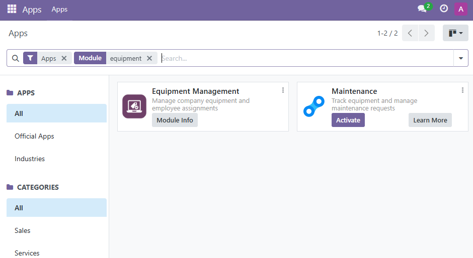
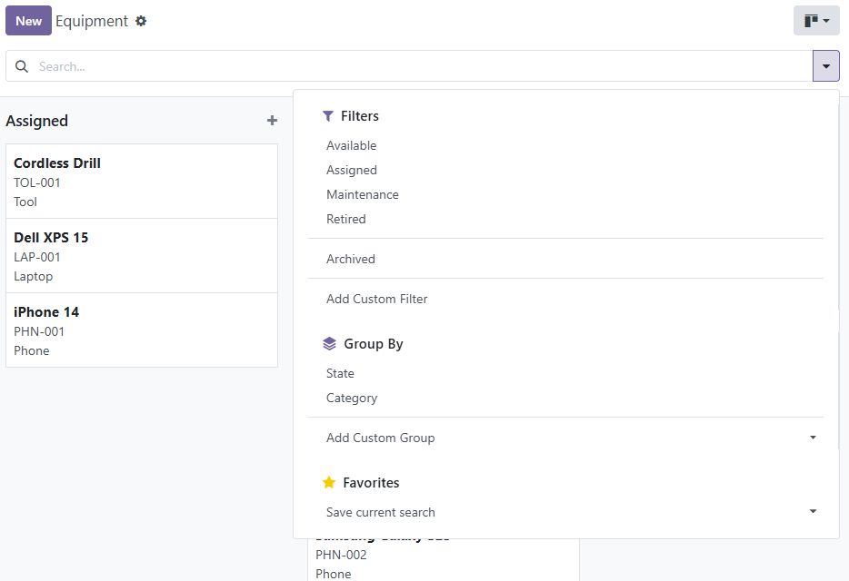
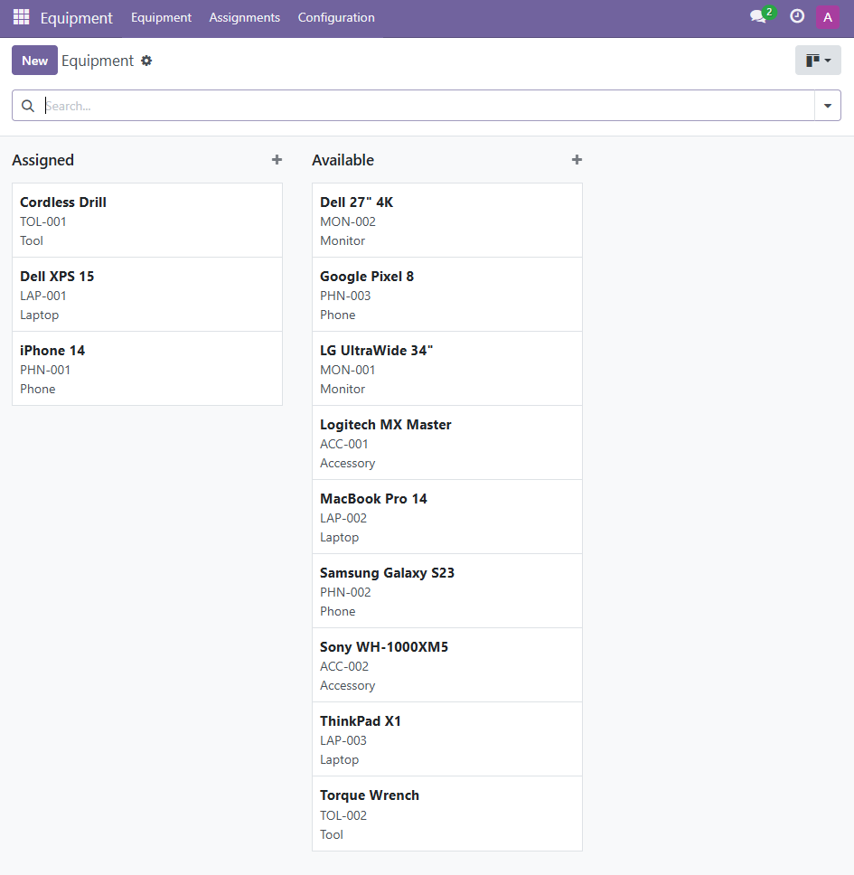
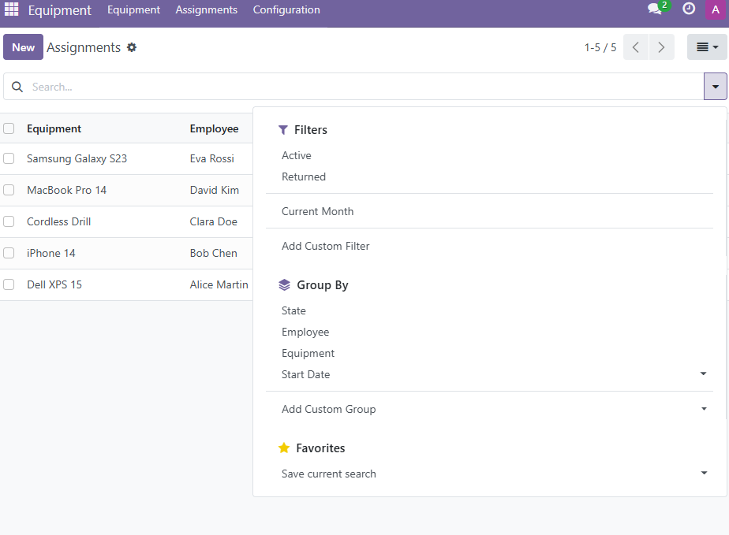
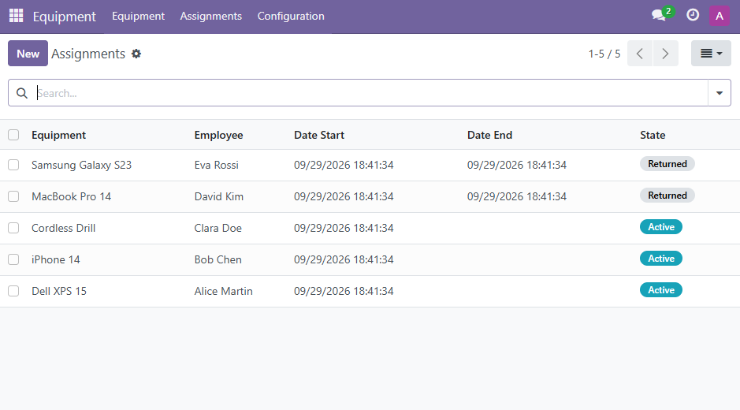
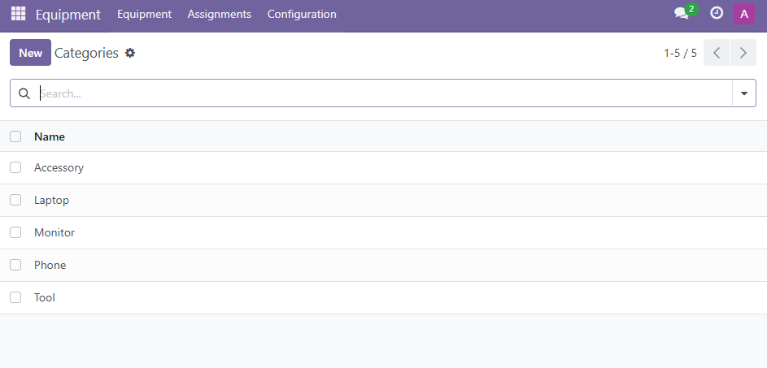

# Equipment Management — Odoo 17 Module

Manage company equipment and track assignments to employees, inside Odoo.

## Business Need

The company tracked equipment (laptops, phones, tools) in spreadsheets and emails, causing:

- No clear view of who holds what
- No assignment history
- Equipment marked "in use" while actually idle
- No visibility for managers
- Slow, unmaintainable as data grows

This module replaces that with a native Odoo workflow.

## Screenshots

### Module Overview


### Equipment List — Filters


### Available Equipment


### Assignments — Filters


### Assignments


### Categories


## Features

- Register company equipment with category, reference, state
- Assign equipment to employees
- Track given / returned dates
- Fast filtering, grouping, and kanban status
- Full assignment history per item
- Role-based access (User / Manager)

## Architecture

```
hr.employee ──┐
              ├──> equipment.assignment ──> equipment.equipment ──> equipment.category
```

- `equipment.assignment` links an employee to an item with dates and status
- `equipment.equipment.current_assignment_id` is a stored pointer to the active assignment for instant lookups
- `equipment.category` is a lightweight lookup table for filtering and grouping

## Data Model

### equipment.equipment

The item itself.

- name, reference (asset tag, unique), category_id
- state: available / assigned / maintenance / retired
- current_assignment_id: denormalized pointer to the active assignment (instant "who has it now" without JOIN)
- assignment_ids: full history (One2many)

### equipment.assignment

One record per hand-out. Kept forever as history.

- equipment_id, employee_id (→ hr.employee)
- date_start, date_end
- state: active / returned

### equipment.category

Lookup table (Laptop, Phone, Tool…) — enables clean group-bys and filters.

Why a table? Users can add new categories on the fly, and Odoo gives group-by/filter menus for free.

## Security

| Group | Equipment | Assignment | Category |
|-------|-----------|------------|----------|
| Equipment / User | CRU (no delete) | CRU (no delete) | R + C |
| Equipment / Manager | Full | Full | Full |

- User = operational staff handing out equipment
- Manager = supervisor, inherits User rights
- Admin is auto-assigned to Manager on install

## Performance Considerations

Designed for tens of thousands of equipment items and continuous history growth.

- Denormalized current_assignment_id → instant "who has it now" queries
- Indexes on all searchable/filterable fields (name, reference, state, category_id, equipment_id, employee_id, date_start)
- Partial unique index enforces one active assignment per equipment at the DB level — safe under concurrency
- Unique partial index on reference — ignores empty values
- read_group used for counting — one query per page, not N
- History kept in a separate table so equipment stays lean as data grows
- No heavy loops on load — computes are either stored or use aggregated queries

## Performance Benchmarks

Tested with 10,000 equipment records on a local Docker Odoo 17 + Postgres 15:

| Operation | Time |
|-----------|------|
| Bulk create 10k equipment | 4.82 s |
| List read (80 rows) | 1.6 ms |
| Filtered read by state | 2.5 ms |

Query plans use the indexes on state, reference, and the partial unique index on reference. The denormalized current_assignment_id avoids JOINs when displaying "who has it now".

## Assumptions

Requirements were intentionally open-ended. Assumptions taken:

1. User = operational staff (not regular employees). Brief says "operational users managing daily assignments" → they need to see all equipment, not just their own.
2. No record rules → all Users see all data. Simpler and matches the brief.
3. History is never deleted → assignments are kept as immutable log.
4. Equipment can be in maintenance / retired — not required by brief but realistic and useful for filtering.
5. reference = asset tag / serial — uniqueness enforced when provided.
6. Employees are reused from hr.employee — no parallel table.

## Scope Notes

Out of scope for this exercise: record rules per team, barcode scanning, reporting views. These are natural next steps once the core workflow is validated.

## Future Enhancements

Natural next steps once the core workflow is validated:

- QR / barcode badge per equipment — scan to assign or return
- Storage location tracking (rack, shelf, bin)
- Email notifications on assignment and return
- Chatter audit trail on equipment
- Dashboard: usage rate, idle items, per-employee view

## Install

```bash
docker run -d -e POSTGRES_USER=odoo -e POSTGRES_PASSWORD=odoo -e POSTGRES_DB=postgres --name db postgres:15
docker run -d -p 8069:8069 --name odoo --link db:db \
  -v "$(pwd)/equipment_mgmt:/mnt/extra-addons/equipment_mgmt" \
  -t odoo:17
```

Then in Odoo: Apps → Update Apps List → Equipment Management → Install.

## Demo Data

To populate the database with demo data for exploration or screenshots:

```bash
MSYS_NO_PATHCONV=1 docker exec -i odoo odoo shell -d equipment \
  --db_host=db --db_user=odoo --db_password=odoo \
  < equipment_mgmt/scripts/seed_demo.py
```

## License

LGPL-3